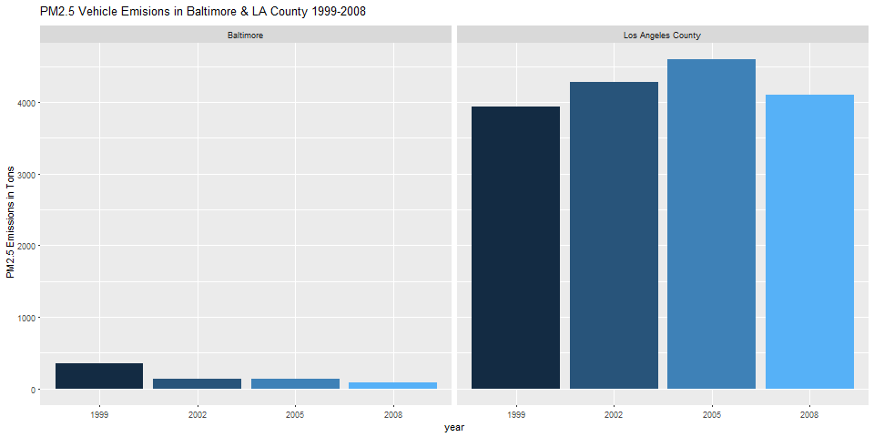

*This document describes the work I did for the second course project in the Corsera online class, Exploratory Data Analysis.  The first part of the document uses the introduction to the project and description of the data taken directly from the course materials.  The second part presents my work and findings.*

#PART ONE:  COURSE DESCRIPTION OF THE PROJECT
## Introduction

Fine particulate matter (PM2.5) is an ambient air pollutant for which there is strong evidence that it is harmful to human health. In the United States, the Environmental Protection Agency (EPA) is tasked with setting national ambient air quality standards for fine PM and for tracking the emissions of this pollutant into the atmosphere. Approximatly every 3 years, the EPA releases its database on emissions of PM2.5. This database is known as the National Emissions Inventory (NEI). You can read more information about the NEI at the [EPA National Emissions Inventory web site.](http://www.epa.gov/ttn/chief/eiinformation.html)

For each year and for each type of PM source, the NEI records how many tons of PM2.5 were emitted from that source over the course of the entire year. The data that you will use for this assignment are for 1999, 2002, 2005, and 2008.

## Data
The data for this assignment are available from the course web site as a single zip file:

- [Data for Peer Assessment](https://d396qusza40orc.cloudfront.net/exdata%2Fdata%2FNEI_data.zip) [29Mb]

The zip file contains two files:

PM2.5 Emissions Data (summarySCC_PM25.rds): This file contains a data frame with all of the PM2.5 emissions data for 1999, 2002, 2005, and 2008. For each year, the table contains number of **tons** of PM2.5 emitted from a specific type of source for the entire year. Here are the first few rows.

````
##     fips      SCC Pollutant Emissions  type year
## 4  09001 10100401  PM25-PRI    15.714 POINT 1999
## 8  09001 10100404  PM25-PRI   234.178 POINT 1999
## 12 09001 10100501  PM25-PRI     0.128 POINT 1999
## 16 09001 10200401  PM25-PRI     2.036 POINT 1999
## 20 09001 10200504  PM25-PRI     0.388 POINT 1999
## 24 09001 10200602  PM25-PRI     1.490 POINT 1999
````

* `fips`: A five-digit number (represented as a string) indicating the U.S. county
* `SCC`: The name of the source as indicated by a digit string (see source code classification table)
* `Pollutant`: A string indicating the pollutant
* `Emissions`: Amount of PM2.5 emitted, in tons
* `type`: The type of source (point, non-point, on-road, or non-road)
* `year`: The year of emissions recorded


Source Classification Code Table (Source_Classification_Code.rds): This table provides a mapping from the SCC digit strings in the Emissions table to the actual name of the PM2.5 source. The sources are categorized in a few different ways from more general to more specific and you may choose to explore whatever categories you think are most useful. For example, source "10100101" is known as "Ext Comb /Electric Gen /Anthracite Coal /Pulverized Coal".

You can read each of the two files using the readRDS() function in R. For example, reading in each file can be done with the following code:

````
## 1  This first line will likely take a few seconds. Be patient!
## 2  NEI<-readRDS("summarySCC_PM25.rds")
## 3  SCC<-readRDS("Source_Classification_Code.rds")
````

as long as each of those files is in your current working directory (check by calling  dir()  and see if those files are in the listing).

## Assignment
The overall goal of this assignment is to explore the National Emissions Inventory database and see what it say about fine particulate matter pollution in the United states over the 10-year period 1999-2008. You may use any R package you want to support your analysis.

### Questions
You must address the following questions and tasks in your exploratory analysis. For each question/task you will need to make a single plot. Unless specified, you can use any plotting system in R to make your plot.

1. Have total emissions from PM2.5 decreased in the United States from 1999 to 2008? Using the base plotting system, make a plot showing the total PM2.5 emission from all sources for each of the years 1999, 2002, 2005, and 2008.
2. Have total emissions from PM2.5 decreased in the Baltimore City, Maryland (fips == "24510") from 1999 to 2008? Use the base plotting system to make a plot answering this question.
3. Of the four types of sources indicated by the type (point, nonpoint, onroad, nonroad) variable, which of these four sources have seen decreases in emissions from 1999-2008 for Baltimore City? Which have seen increases in emissions from 1999-2008? Use the ggplot2 plotting system to make a plot answer this question.
4. Across the United States, how have emissions from coal combustion-related sources changed from 1999-2008?
5. How have emissions from motor vehicle sources changed from 1999-2008 in Baltimore City?
6. Compare emissions from motor vehicle sources in Baltimore City with emissions from motor vehicle sources in Los Angeles County, California (fips == "06037"). Which city has seen greater changes over time in motor vehicle emissions?

###Making and Submitting Plots
For each plot you should

* Construct the plot and save it to a PNG file.
* Create a separate R code file (plot1.R, plot2.R, etc.) that constructs the corresponding plot, i.e. code in plot1.R constructs the plot1.png plot. Your code file should include code for reading the data so that the plot can be fully reproduced. You must also include the code that creates the PNG file. Only include the code for a single plot (i.e. plot1.R should only include code for producing plot1.png)
* Upload the PNG file on the Assignment submission page
* Copy and paste the R code from the corresponding R file into the text box at the appropriate point in the peer assessment.


#My Work and Findings
###Question 1
*Have total emissions from PM2.5 decreased in the United States from 1999 to 2008? **Using the base plotting system,** make a plot showing the total PM2.5 emission from all sources for each of the years 1999, 2002, 2005, and 2008.*

Clearly, total emissions from PM2.5 have decreased in the US from 1999 to 2008, as seen in the graph below.


I used the following code to process the data and generate the graph:
````
library(dplyr)

##Read in data
NEIdata<-readRDS("./summarySCC_PM25.rds")
classcodes<-readRDS("./Source_Classification_Code.rds")

##Pull tons of pollution by year, then create annual sums variable
yeardata<-NEIdata %>% group_by(year) %>%
  filter(year==1999|2002|2005|2008) %>%
  summarize(yeartotal = sum(Emissions))

##Create plot1.png
png("plot1.png", width = 480, height = 480)
plot(yeardata$year, yeardata$yeartotal/1000000, 
     type="l",xlab= expression("Year"), ylab = expression("Tons in Millions of PM2.5 Emissions"))
dev.off()
````

###Question 2
*Have total emissions from PM2.5 decreased in the Baltimore City, Maryland (fips == "24510") from 1999 to 2008? Use the **base plotting system** to make a plot answering this question.*

There was a significant drop in total emissions from PM2.5 in Baltimore City between 1999 and 2008.  Interestingly, there was spike upwards between 2002 and 2005, but the overall trend was downward.


I used the following code to process the data and generate the graph:
````
library(dplyr)

##Read in data
NEIdata<-readRDS("./summarySCC_PM25.rds")
classcodes<-readRDS("./Source_Classification_Code.rds")

##Pull Baltimore data, then create annual sums variable
baltimoredata<-NEIdata %>% 
  filter(fips=="24510") %>%
  group_by(year) %>%
  filter(year==1999|2002|2005|2008) %>%
  summarize(yeartotal = sum(Emissions))

##Create plot2.png
png("plot2.png", width = 480, height = 480)
plot(baltimoredata$year, baltimoredata$yeartotal, 
     type="l",xlab= expression("Year"), ylab = expression("Tons of PM2.5 Emisions"),
     main="PM2.5 Emissions in Baltimore 1999-2008")
dev.off()
````

###Question 3
*Of the four types of sources indicated by the type (point, nonpoint, onroad, nonroad) variable, which of these four sources have seen decreases in emissions from 1999-2008 for Baltimore City? Which have seen increases in emissions from 1999-2008? **Use the ggplot2 plotting system** to make a plot answer this question.*

Three of the four sources (nonpoint, onroad and nonroad) showed marked decreases in emissions between 1999 and 2008.  The fourth source, point, showed a slight increase in emissions, though this is down from a significant upward trajectory between 1999 and 2005.


I used the following code to process the data and generate the graph:
````
library(dplyr)
library(ggplot2)

##Read in data
NEIdata<-readRDS("./summarySCC_PM25.rds")
classcodes<-readRDS("./Source_Classification_Code.rds")

##Pull Baltimore data, then create annual sums variable
baltimoredata<-NEIdata %>% 
  filter(fips=="24510") %>%
  group_by(type, year) %>%
  summarize(yeartotal = sum(Emissions))

##Create plot3.png
png("plot3.png", width = 960, height = 480)
ggplot(baltimoredata, aes(x=factor(year), y=yeartotal, fill=type))+
  geom_bar(stat = "identity") +
  facet_grid(.~type) +
  labs(x="year", y=expression("Tons of PM2.5 Emissions"), 
       title = expression("PM2.5 Emisions in Baltimore by Source Type 1999-2008"))
dev.off()
````

###Question 4
*Across the United States, how have emissions from coal combustion-related sources changed from 1999-2008?*

Nationwide, US emissions were significantly lower in 2008 compared to 1999.  There was a drop from 1999 to 2002.  After a slight increase in 2005, emmissions plummeted by 2008.


I used the following code to process the data and generate the graph:
````
library(dplyr)
library(ggplot2)


##Read in data
NEIdata<-readRDS("./summarySCC_PM25.rds")
classcodes<-readRDS("./Source_Classification_Code.rds")

##Pull coal combustion data
combcoal<-grepl("Fuel Comb.*Coal", classcodes$EI.Sector)
CCcombcoal<-classcodes[combcoal, ]$SCC
NEIcombcoal<-NEIdata[NEIdata$SCC %in% CCcombcoal,]
NEIcoalsums<-NEIcombcoal %>%
  group_by(year) %>%
  summarize(yeartotal = sum(Emissions))
  
##Create plot4.png
png("plot4.png", width = 960, height = 480)
ggplot(NEIcoalsums, aes(x=factor(year), y=yeartotal/100000, fill=year))+
  geom_bar(stat = "identity") +
  labs(x="year", y=expression("PM2.5 Emissions in 100,000 Tons"), 
       title = expression("PM2.5 Coal Emisions in US 1999-2008"))
dev.off()
````

###Question 5
*How have emissions from motor vehicle sources changed from 1999-2008 in Baltimore City?*

The reduction of emissions from motor vehicles in Baltimore City were dramatic.  2008 emissions were almost a quarter of emissions from 1999.


I used the following code to process the data and generate the graph:
````
library(dplyr)
library(ggplot2)

##Read in data
NEIdata<-readRDS("./summarySCC_PM25.rds")
classcodes<-readRDS("./Source_Classification_Code.rds")

##Pull vehicles data for Baltimore
vehicles<-grepl("Vehicles", classcodes$EI.Sector)   ##pull vehicle tags
CCVehicles<-classcodes[vehicles, ]$SCC              ##pull SCC #'s for vehicles
NEIVehicles<-NEIdata[NEIdata$SCC %in% CCVehicles,]  ##pull vehicles from NEI data
baltimoredata<-NEIVehicles %>% 
  filter(fips=="24510") %>%
  group_by(type, year) %>%
  summarize(yeartotal = sum(Emissions))             ##organize by year and create annual sum variable

##Create plot5.png
png("plot5.png", width = 960, height = 480)
ggplot(baltimoredata, aes(x=factor(year), y=yeartotal, fill=year))+
  geom_bar(stat = "identity") +
  guides(fill=FALSE)
  labs(x="year", y=expression("PM2.5 Emissions in Tons"), 
       title = expression("PM2.5 Vehicle Emisions in Baltimore 1999-2008"))
dev.off()
````

###Question 6
*Compare emissions from motor vehicle sources in Baltimore City with emissions from motor vehicle sources in Los Angeles County, California (fips == "06037"). Which city has seen greater changes over time in motor vehicle emissions?*

Between the two locations, Baltimore City showed the most dramatic change from 1999 to 2008.  While Baltimore cut its motor vehicle emissions to alomst a quarter of 1999 numbers, LA County should a slight increase in emissions over the same period.  Interestingly, LA County and Baltimore a dealing with this type of emissions on a completely different scale.  In 1999, LA County had more than 11 times the emissions, in 2008 it is almost 47 times, the emissions of Baltimore.



I used the following code to process the data and generate the graph:
````
library(dplyr)
library(ggplot2)

##Read in data
NEIdata<-readRDS("./summarySCC_PM25.rds")
classcodes<-readRDS("./Source_Classification_Code.rds")

##Pull vehicles data 
vehicles<-grepl("Vehicles", classcodes$EI.Sector)   ##pull vehicle tags
CCVehicles<-classcodes[vehicles, ]$SCC              ##pull SCC #'s for vehicles
NEIVehicles<-NEIdata[NEIdata$SCC %in% CCVehicles,]  ##pull vehicles from NEI data

##Pull Baltimore data
baltimoredata<-NEIVehicles %>% 
  filter(fips=="24510") %>%
  group_by(type, year) %>%
  summarize(yeartotal = sum(Emissions))             ##organize by year and create annual sum variable
baltimoredata$location<-"Baltimore"

##Pull Los Angeles County data
ladata<-NEIVehicles %>% 
  filter(fips=="06037") %>%
  group_by(type, year) %>%
  summarize(yeartotal = sum(Emissions))             ##organize by year and create annual sum variable
ladata$location<-"Los Angeles County"

##Combine datasets
allvehicle<-rbind(baltimoredata,ladata)

##Create plot6.png
png("plot6.png", width = 960, height = 480)
ggplot(allvehicle, aes(x=factor(year), y=yeartotal, fill=location))+
  geom_bar(aes(fill=year), stat = "identity") +
  facet_grid(scales="free", space="free", .~location) +
  guides(fill=FALSE) +
  labs(x="year", y=expression("PM2.5 Emissions in Tons"), title = expression("PM2.5 Vehicle Emisions in Baltimore & LA County 1999-2008"))
dev.off()
````